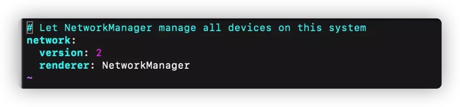
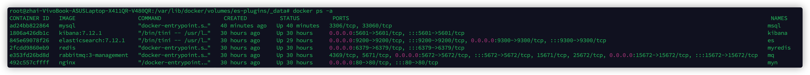
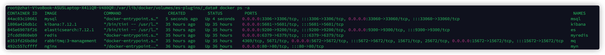

# 环境

https://www.wolai.com/atguigu/m4z5zhigfZdUSvfTUJvYZM

## 改造系统

ubuntu 22.04.2 LTS

https://blog.csdn.net/jxq1994/article/details/124198140

## ssh连接

https://blog.csdn.net/dolpin_ink/article/details/127462554

`ssh 用户名@ip`

`ssh zhai@192.168.31.166`

## 固定ip

未修改



https://blog.csdn.net/qq_44678607/article/details/129669039

`ifconfig`，查看ip，192.168.31.166

`netstat -rn`查看网关，192.168.31.1

测试网络 `ping -c 3 www.baidu.com`

修改文件不成功的话，切换root用户再修改

https://www.cnblogs.com/liujiaxin2018/p/17155328.html

https://blog.csdn.net/qq_36393978/article/details/124868232

https://zhuanlan.zhihu.com/p/612288061

```shell
renderer: NetworkManager
# 这个不注释掉
# 有这个才是ubuntu 22.04版本
```

## 打开所有端口

打开所有外部端口，1-65535都打开

```shell
sudo ufw allow 1:65535/tcp
sudo ufw allow 1:65535/udp
```

## 不休眠设置

ubuntu设置关闭屏幕后仍运行

https://blog.csdn.net/qq_41604569/article/details/129255927

## 安装使用finalshell或Termius

用户名我自己设定的不是root是zhai

## 切换root

`sudo -i` 是一个命令，用于以root用户身份登录到当前终端会话。执行此命令后，您将获得root用户的权限和环境

## docker安装

从 Ubuntu 22.04 开始，Docker Engine-Community 已经更名为 Docker Engine。您可以按照以下步骤在 Ubuntu 22.04 上安装 Docker Engine：

1. 更新软件包索引和系统：

   ```shell
   sqlCopy code
   sudo apt update
   sudo apt upgrade
   ```

2. 安装 Docker 依赖：

   ```shell
   Copy code
   sudo apt install -y apt-transport-https ca-certificates curl software-properties-common
   ```

3. 添加 Docker 官方 GPG 密钥：

   ```shell
   bashCopy code
   curl -fsSL https://download.docker.com/linux/ubuntu/gpg | sudo gpg --dearmor -o /usr/share/keyrings/docker-archive-keyring.gpg
   ```

4. 添加 Docker APT 仓库：

   ```shell
   bashCopy code
   echo "deb [arch=amd64 signed-by=/usr/share/keyrings/docker-archive-keyring.gpg] https://download.docker.com/linux/ubuntu $(lsb_release -cs) stable" | sudo tee /etc/apt/sources.list.d/docker.list > /dev/null
   ```

5. 安装 Docker Engine：

   ```shell
   luaCopy code
   sudo apt update
   sudo apt install -y docker-ce docker-ce-cli containerd.io
   ```

6. 验证安装是否成功：

   ```shell
   arduinoCopy code
   sudo docker run hello-world
   ```

如果一切顺利，您将看到 "Hello from Docker!" 的输出，表示 Docker Engine 安装成功。

请注意，安装 Docker 需要具有适当的系统权限，您可能需要使用 `sudo` 命令或以 root 用户身份执行上述命令。

要查看已安装的 Docker 版本，请使用以下命令：

```shell
Copy code
docker version
```

### 关闭防火墙

> docker涉及端口映射，建议先关闭防火墙，避免端口屏蔽！

在Ubuntu上，可以使用`ufw`命令来关闭防火墙并禁止其在系统启动时自动启动。请按照以下步骤操作：

1. 检查防火墙状态：

   ```
   luaCopy code
   sudo ufw status
   ```

   如果防火墙已启用，您将看到类似以下输出：

   ```
   makefileCopy code
   Status: active
   ```

2. 关闭防火墙：

   ```
   bashCopy code
   sudo ufw disable
   ```

   系统会提示您确认是否关闭防火墙，输入"y"并按回车确认。

3. 禁止防火墙开机启动：

   ```
   bashCopy code
   sudo systemctl disable ufw
   ```

   这会禁用`ufw`服务在系统启动时自动启动。

4. 重新启动系统以使更改生效：

   ```
   Copy code
   sudo reboot
   ```

   系统会重新启动，此时防火墙将保持关闭状态，并且不会在启动时自动启用。

5. 检查防火墙状态（可选）：

   ```
   luaCopy code
   sudo ufw status
   ```

   如果输出显示为"Inactive"，则表示防火墙已成功关闭。

### 启动和停止docker

```Bash
systemctl start docker  # 启动docker服务

systemctl stop docker  # 停止docker服务

systemctl restart docker  # 重启docker服务

systemctl status docker #查看docker状态

docker -v
```

### docker配置阿里镜像

### mysql容器启动问题

使用课程给的命令启动：

```bash
docker run --name msql -v /msql/conf:/etc/mysql/conf.d -e MYSQL_ROOT_PASSWORD=root -d mysql --character-set-server=utf8mb4 --collation-server=utf8mb4_unicode_ci
```

效果：



无法连接mac的navicat

使用：

```bash
docker run --name msql -p 3306:3306 -p 33060:33060 -v /msql/conf:/etc/mysql/conf.d -e MYSQL_ROOT_PASSWORD=root -d mysql --character-set-server=utf8mb4 --collation-server=utf8mb4_unicode_ci 
```



连接成功

在Docker容器中，端口映射的格式可以是以下两种形式之一：

1. `0.0.0.0:主机端口号->容器端口号/tcp`：这种格式表示将容器内的某个端口映射到主机上的指定端口，并且容器内的服务会绑定到容器的所有网络接口上。通过这种映射方式，可以从主机的所有网络接口上访问容器内的服务，包括本地回环接口（localhost）和主机的所有网络接口（如局域网、公网等）。
2. `容器端口号/tcp`：这种格式表示容器内的某个端口号，但没有指定将其映射到主机的哪个端口。在这种情况下，容器内的服务通常会绑定到容器的默认网络接口上（通常是容器的内部IP地址），并且只能从容器内部或通过Docker网络进行访问，无法通过主机的网络接口直接访问。

因此，对于第一种形式的端口映射，可以通过主机的IP地址和映射的端口号从主机及其他局域网内的计算机访问容器内的服务。而对于第二种形式的端口映射，只能在容器内部或通过Docker网络进行访问。

在您提供的结果中，MySQL容器的端口映射为`3306/tcp, 33060/tcp`，没有显示为`0.0.0.0:端口号->端口号/tcp`的形式。这意味着MySQL服务已经绑定到了容器内的所有网络接口上，但没有映射到主机的指定端口上。因此，只能在容器内部或通过Docker网络进行访问MySQL服务，而无法直接通过主机的网络接口访问。但是，只要确保容器所在的宿主机在局域网内可访问，并使用正确的容器内部IP地址和端口号，您仍然可以从同一局域网内的其他计算机连接到MySQL容器。